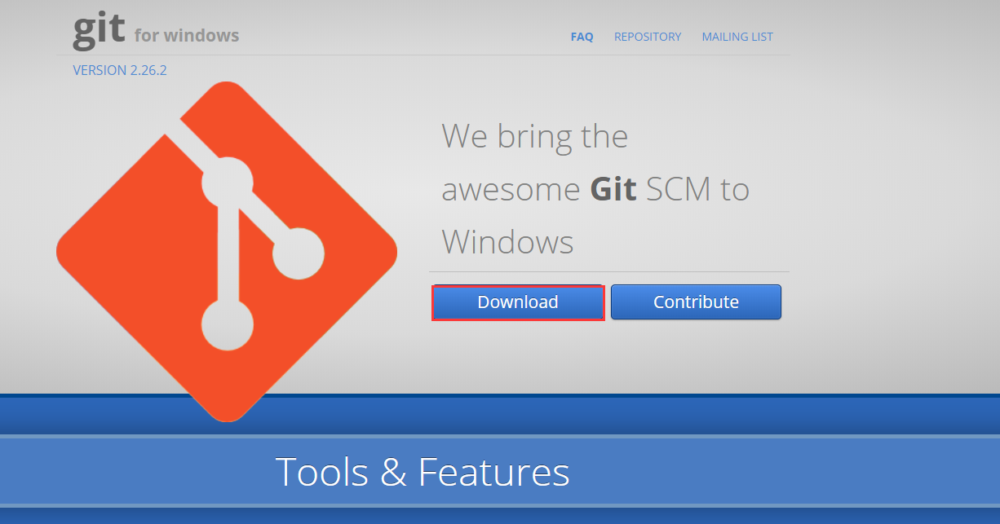
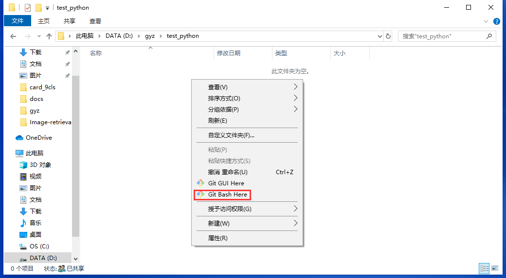
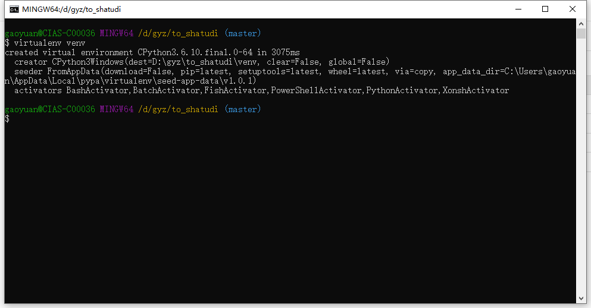
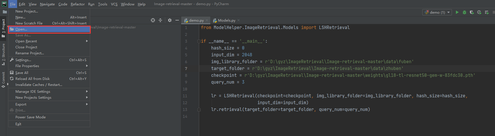
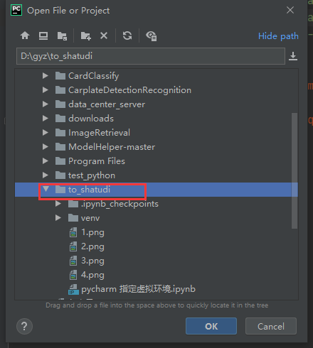
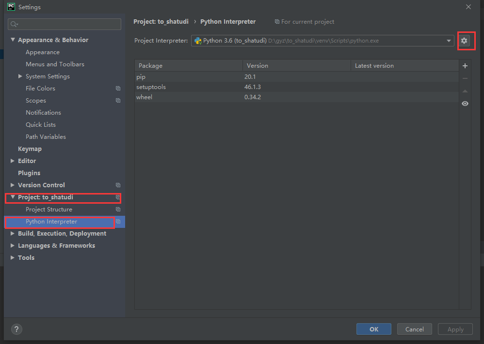
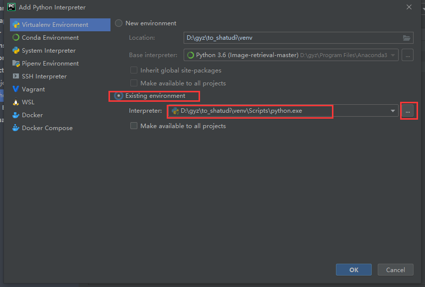
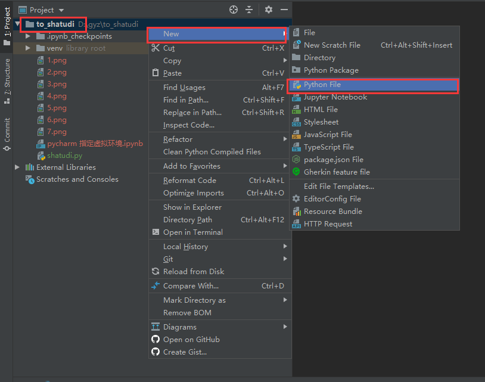
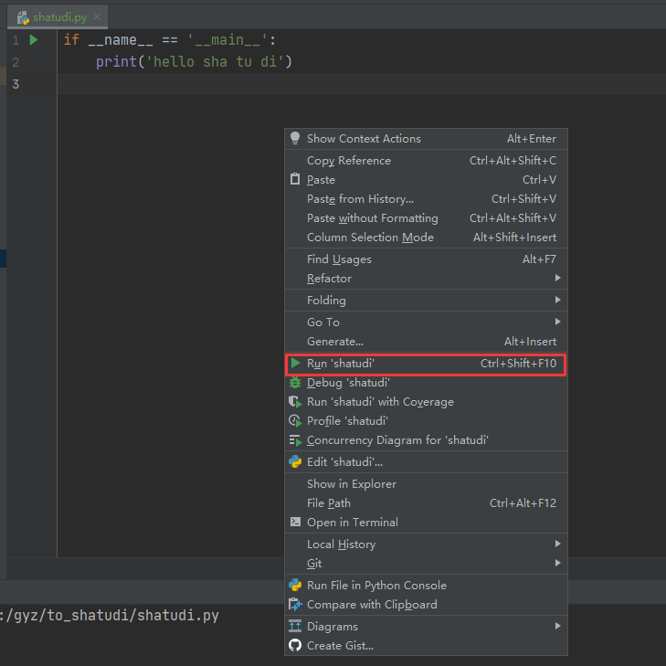
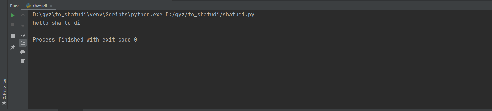

## 虚拟环境virtualenv的创建
详情见教程 https://www.liaoxuefeng.com/wiki/1016959663602400/1019273143120480
### 安装virtualenv
打开黑窗口,输入下面命令完成安装
pip install virtualenv
或者
pip3 install virtualenv
### 安装gitbash
#### 
下载地址： https://gitforwindows.org/

安装教程自行百度。

创建虚拟环境
创建任意文件夹，文件夹名称只能包含字母和数字；单机鼠标右键，点击gitbash here;

输入 virtualenv venv 创建名称为venv的虚拟环境；创建成功之后会发现该路径下多了一个venv文件夹，点ok。

### pycharm 导入虚拟环境
打开pycharm 点击file>open 选定包含venv的文件夹；

此时，pycharm成功导入刚刚创建的虚拟环境，前提是刚刚的虚拟环境名称为venv；

若需要导入其他环境，可点击file>settings，可见如下窗口，以此点击Project：to_shatudi，python interpreter, 齿轮，点击齿轮后选择add； 

勾选existing environment, 点击... 找到venv/Scripts/下的python.exe,点击ok。此时pycharm会导入该虚拟环境。

### 第一行代码
鼠标移至项目名称处，点击右键，new，python file，创建python脚本；命名可随意取，但名称只能包含字母与数字还有下划线；

在脚本中输入以下内容：
if __name__ == '__main__':
    print('hello sha tu di')

鼠标移至书写代码的区域，右键，点击run即可运行代码，至此教学结束。

